# Re:Learn

**A trained model finds the *misconception* behind a beginner's wrong Python code, the app teaches that one idea, then checks it actually stuck - a correct follow-up answer alone is not enough.**

Built for **Bit N Build 2026 - AI/ML track**. Domain: introductory Python programming.

| Diagnose | Intervene | Prove it |
|---|---|---|
| 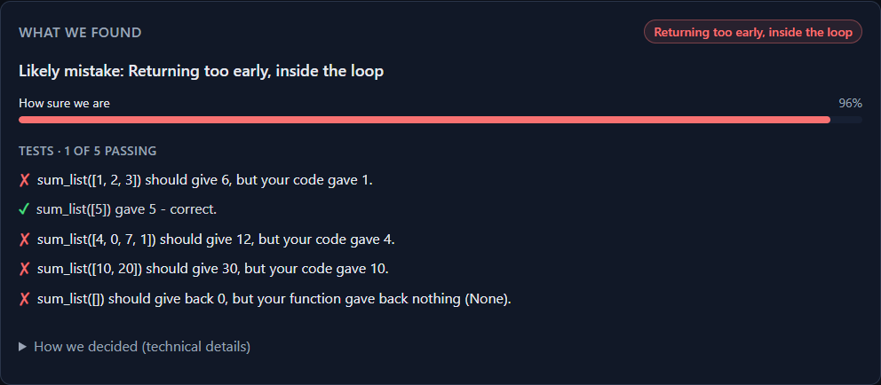 | 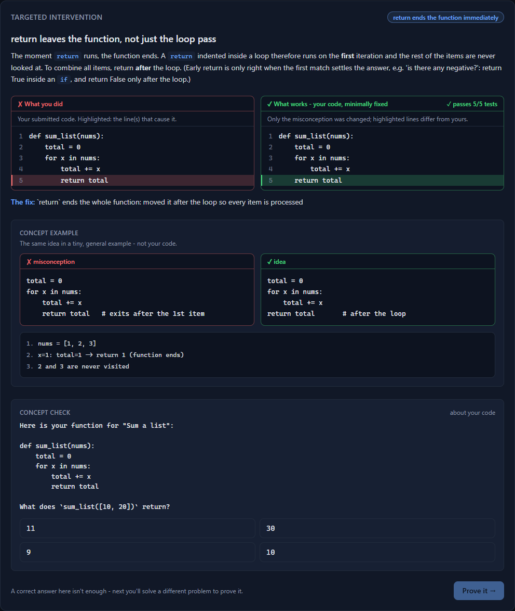 | 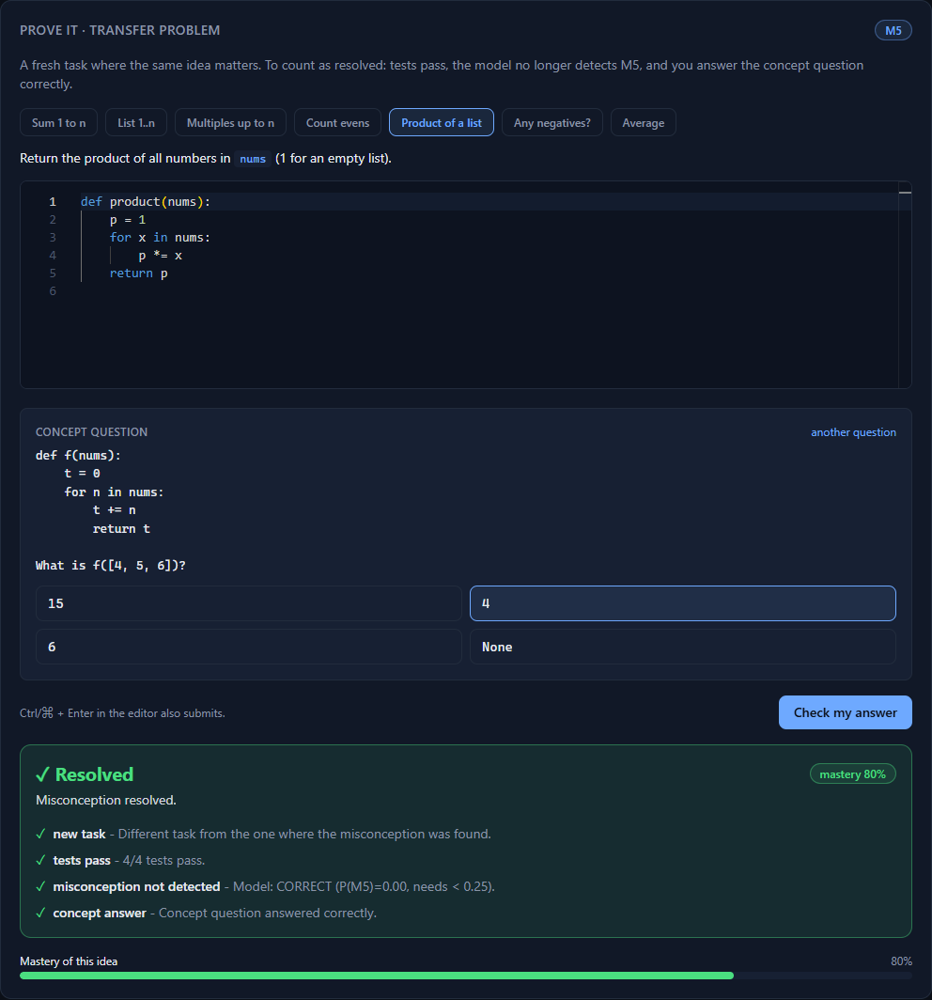 |

---

## Contents

1. [Problem](#problem) · 2. [Our approach](#our-approach) · 3. [Architecture](#architecture) · 4. [Misconception taxonomy and twin pairs](#misconception-taxonomy-and-twin-pairs) · 5. [How reassessment works](#how-reassessment-works) · 6. [Model and metrics](#model-and-metrics) · 7. [Screenshots](#screenshots) · 8. [Setup on Windows](#setup-on-windows) · 9. [API](#api) · 10. [Repo layout](#repo-layout) · 11. [Deployment](#deployment) · 12. [Limitations](#limitations-read-this)

---

## Problem

Autograders say a solution is **wrong**. They don't say **why**. A beginner who writes `range(1, n)` and gets the wrong sum needs a different lesson from one who writes `return total` inside the loop - yet both just see "2 of 4 tests failed". Worse, fixing the symptom ("add `+ 1`") often leaves the underlying belief intact, and the same mistake comes back on the next problem.

Two things make this hard:

1. **Different causes, same wrong output ("twins").** Dropping the first list item vs. dropping the last one; keeping only the first item vs. only the last. Output alone can't tell them apart - the *structure* of the code can.
2. **"Correct" is not "learned".** A learner can pass the follow-up by luck, memory, or by fixing only the exact line they were told about.

## Our approach

Re:Learn is a closed loop with a **trained model in the middle** and a deliberately strict exit condition:

1. **Diagnose** - the learner's code runs in a sandbox against hidden tests. A LightGBM classifier reads *how the code is built* (AST signals) and *how it behaves* (execution signals) and names one of 8 misconceptions - or `CORRECT` - with a calibrated confidence and human-readable evidence.
2. **Intervene** - a targeted mini-lesson for exactly that misconception, built around **the learner's own code**: their submitted code with the offending line(s) highlighted, next to a **minimal fix of that same code** (only what the misconception requires: `print` -> `return`, `range(1, n)` -> `range(1, n + 1)`, accumulator moved out of the loop, ...). The fix is generated by a per-misconception rule and **verified by running the problem's tests**; if no safe small edit passes, a verified reference solution is shown instead, and the two panels are never identical. The generic concept example and its trace sit below, followed by a concept check.
3. **Prove it** - the learner solves a **different** problem where the same idea matters and answers a concept question. The misconception is marked **resolved only if** the tests pass **and** the model no longer detects that misconception **and** the concept answer is right **and** it's a new task. Otherwise the answer is **"Not yet"**, with the exact reasons.
4. **Track** - per-misconception mastery (0..1) and the full attempt history are stored per learner.

## Architecture

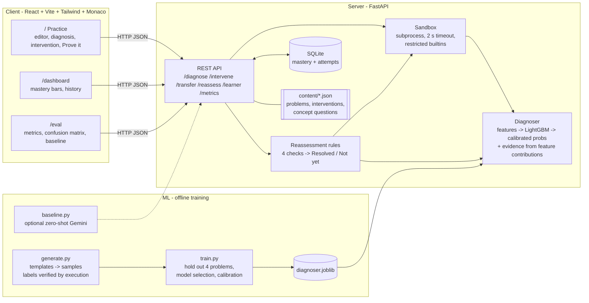

**One pass through the loop**

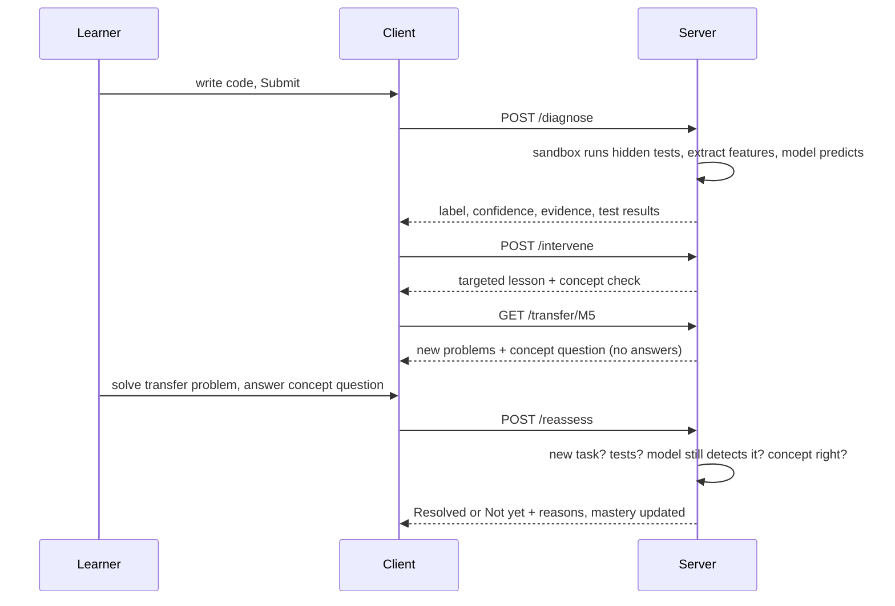

## Misconception taxonomy and twin pairs

| ID | Misconception | Typical wrong code | Core idea to teach |
|---|---|---|---|
| `CORRECT` | none | | |
| **M1** `RANGE_OFF_BY_ONE` | `range()` excludes its end | `range(1, n)` to include `n`; `range(len(x) - 1)` | stop is exclusive: `range(1, n + 1)` |
| **M2** `INDEX_FROM_ONE` | list indexes start at 1 | `x[1]` as first item; `x[len(x)]` as last; loop from index 1 | first is `x[0]`, last is `x[-1]` |
| **M3** `PRINT_NOT_RETURN` | `print` = `return` | `print(total)` with no `return` | a function with no `return` gives back `None` |
| **M4** `ACCUMULATOR_RESET` | accumulator initialised inside the loop | `for x in xs: total = 0; total += x` | initialise once, before the loop |
| **M5** `RETURN_IN_LOOP` | `return` just ends this iteration | `for ...: total += x; return total` | `return` leaves the whole function |
| **M6** `FLOAT_DIVISION` | `//` or `int()` where decimals are needed | `sum(x) // len(x)`; `c * (9 // 5) + 32` | `/` gives the exact quotient; `//` floors |
| **M7** `STRING_MUTABLE` | strings change in place | `s[0] = 'X'`; `s.upper()` with result discarded | strings are immutable, methods return new strings |
| **M8** `LIST_ALIASING` | `b = a` copies a list | `b = a; b.append(x)`; `[[0]*3]*3` | assignment shares the list; copy with `a[:]` |

### Twin pairs - same wrong output, different cause

| Twin pair | Why they look alike | What separates them |
|---|---|---|
| **M1 vs M2** | `sum_list` with `range(len(nums) - 1)` (M1, drops the **last** item) and `range(1, len(nums))` (M2, drops the **first**) both return `14` for `[5, 9, 5]` | stop bound shortened (`len(x) - 1`) vs. start index set to 1 / index `len(x)` used |
| **M4 vs M5** | the accumulator-reset version returns the **last** item, the return-in-loop version returns the **first**; both return `3` for `[3, 1, 3]` and for any one-item list | `total = 0` *inside* the loop body vs. a `return` *directly in* the loop body |

The Practice page has **Load demo bug** buttons for all four, so you can watch the model separate each twin from its partner. The panel is hidden by default; open **http://localhost:5173/?demo=1** to show it.

### How the personalised fix is made

For each misconception the server proposes small, source-preserving edits to the learner's code (character-offset edits guided by the AST, so formatting, comments and names survive), runs each candidate in the sandbox against the problem's tests, and shows the first one that passes everything. Examples: `range(len(x) - 1)` -> `range(len(x))`; `items[len(items)]` -> `items[len(items) - 1]`; `print(total)` -> `return total`; `total = 0` moved above the loop; `return` moved after the loop; `//` -> `/`; `s.upper()` -> `s = s.upper()`; `new = old` -> `new = old[:]`. The highlighted lines are the lines the verified fix changes (or, for insert-only fixes, the lines a pattern locator flags). If no candidate passes, or the "fix" would equal the learner's code, the panel shows a verified **reference solution** for the problem instead (a different correct variant if the learner's code already equals it).

Coverage measured on all wrong samples we have (`server/tests/test_personalize.py`): a verified minimal fix of the learner's own code is produced for **97%** of the 31 hand-written Realistic-set samples and **98%** of 439 unique template samples; the median fix changes 1 line (max 3). The rest fall back to the reference solution - e.g. inverted logic (`if x >= 0: return False`), code that also needs unrelated changes (`round(...)`), or a learner who never returns a value.

## How reassessment works

`POST /reassess` returns `resolved: true` **only if all four checks pass**; every check comes back with a pass/fail and a reason, so "Not yet" is always explained.

| Check | Passes when |
|---|---|
| `new_task` | the problem is different from the one where the misconception was found (stops memorised answers) |
| `tests_pass` | all hidden tests pass in the sandbox |
| `misconception_not_detected` | the model gives the target misconception < 25% probability on the new code |
| `concept_answer` | the concept question is answered correctly (answers never leave the server) |

Mastery per misconception starts at 0.5 (unknown); evidence of the misconception lowers it, a failed attempt lowers it, a verified resolution lifts it to at least 0.8. This is a simple, transparent heuristic, not a fitted learner model.

## Model and metrics

**Model**: LightGBM multiclass over 9 labels, temperature-calibrated (T = 1.65; expected calibration error 0.023 on out-of-fold predictions).
**Features** (no raw text needed at inference):
- *AST structure* - `return` directly in a loop, variable re-initialised in a loop, `range` bound patterns, index patterns (`x[len(x)]`, `x[1]`), `//` vs `/`, item assignment on a parameter, discarded string-method results, list aliasing (`b = a` then mutate), `[row] * n`, ...
- *Execution behaviour* - fraction of tests passing, `TypeError`/`IndexError`, returned `None`, printed output, input argument modified, rows sharing memory, type mismatches.
- *Task flags* - parameter and return types.

**Training data**: **synthetic**. ~2,960 samples generated from 22 problems and 212 hand-written solution templates (correct + each misconception), with renaming and structural variation. **Every label is verified by running the code**: `CORRECT` samples must pass all tests, misconception samples must fail at least one. (This check caught a template that augmentation had silently made correct.)

### Headline: the Realistic set (40 hand-written snippets)

To avoid grading the model on its own generator, we wrote **40 messier snippets by hand** ([`ml/data/realistic_test.csv`](ml/data/realistic_test.csv)): indirect loop bounds, `try/except`, recursion, `enumerate`, helper functions, comprehensions, extra debug prints, comments, odd variable names and partial solutions - none produced by the templates. Labels are the intended misconception and were **checked by execution** (`ml/data/build_realistic_test.py`). The serving model was evaluated on it **once**; it was never used for training or model selection.

| metric (Realistic set, n = 40) | value |
|---|---|
| accuracy | **0.950** (38/40; 95% CI 0.83-0.99) |
| macro-F1 | **0.946** |
| M1 vs M2 twin-pair accuracy | **0.875** (7/8; one M2 read as M1) |
| M4 vs M5 twin-pair accuracy | **0.875** (7/8; the miss was read as M1, not as the twin) |

The two misclassifications and two close calls (full table in [`docs/metrics.md`](docs/metrics.md) and on the Eval page, with the code):

| | sample | result | why |
|---|---|---|---|
| miss | `sum_list`, `while` loop starting at index 1 (M2) | read as **M1** at 99% | no AST signal covers a while-loop start at 1 (only `range(1, ...)`), and every while-based M2 in training crashed with `IndexError`, so a quiet wrong sum looked like M1 |
| miss | `count_evens`, `return` directly in a `while` body (M5) | read as **M1** at 50% (M5 got 46%) | only one structural signal fired, and the code passes 3 of 5 tests because the first item often decides the answer |
| close | `nth_item`, `items[n]` inside `try/except` (M2) | right, but only **28%** (M5 27%) | `try/except` swallows the `IndexError` that normally gives M2 away |
| close | `square`, `print(...)` then an explicit `return None` (M3) | right, but only **48%** | explicit `return None` defeats the "prints but never returns" signal; only behaviour carried it |

Two things to take from this: realistic accuracy (0.95) is lower than the template score, and the model can be **confidently wrong** (the 99% miss), so its confidence should not be read as a guarantee. The set is small and the author also wrote the generator, so it is a sanity check on messier code, **not** an independent benchmark.

### Template held-out set - an optimistic upper bound

Split **by problem**: 4 whole problems (`sum_list`, `average`, `shout`, `double_all`; 672 samples) were never seen in training or model selection. Full report: [`docs/metrics.md`](docs/metrics.md) (regenerated by `ml/train.py`).

| metric (unseen problems) | value |
|---|---|
| accuracy | 1.000 |
| macro-F1 | 1.000 |
| M1 vs M2 exact accuracy (84 / 70 samples) | **1.000** (0 swapped) |
| M4 vs M5 exact accuracy (56 / 56 samples) | **1.000** (0 swapped) |


> ### Treat the 1.000 as an upper bound
> A perfect score on 4 problems is **not** evidence the diagnosis problem is solved. The held-out samples are renamed variants of a few dozen templates (so the effective sample size is much smaller than 672), and each held-out problem has close structural siblings in training (e.g. `count_evens` and `product` look like `sum_list`). The more honest estimate is **5-fold grouped cross-validation over all 22 problems**:

| Feature set (5-fold CV, each fold = unseen problems) | macro-F1 | accuracy |
|---|---|---|
| TF-IDF of normalised code only (logistic regression) | 0.570 | 0.656 |
| TF-IDF only (LightGBM) | 0.486 | 0.630 |
| TF-IDF + AST (no execution) | 0.672 | 0.757 |
| TF-IDF + AST + execution + task flags | 0.878 | 0.936 |
| **AST + execution + task flags (no text) - used in production** | **0.943** | **0.962** |

What this tells us:
- **Text alone doesn't generalise** to new problems (0.49-0.57): token n-grams memorise problem-specific wording.
- **Execution behaviour is the biggest single gain** (0.67 → 0.88+), and **dropping the text features helps** (0.878 → 0.943). We therefore select by held-out-problem score, not by "more features is better".
- **Weak spots**: problems with unique structure score lower in grouped CV - `swap_ends` 0.60, `make_grid` 0.64, `replace_at` 0.67, `double_all` 0.77 - because nothing similar was in the training folds.
- An earlier set of 34 hand-written snippets (`ml/relearn_ml/wild.py`) was classified 34/34 correctly; the Realistic set above is the harder, more varied successor and is the number to quote.
- **No real learner data was used.** Real students write messier code and combine misconceptions.

**LLM baseline**: `ml/baseline.py` runs a zero-shot Gemini classifier on the same held-out problems and adds an "Our model vs Gemini baseline" table to `docs/metrics.md` and the Eval page. **It has not been run yet** (needs `GEMINI_API_KEY`); until then the page says *baseline not run*. The comparison will be system vs. system - our model also sees test-execution features that Gemini does not.

## Screenshots

**Twin pairs - same symptom, different cause, correctly separated**

| M1 `range(len(nums) - 1)` | M2 `range(1, len(nums))` |
|---|---|
| 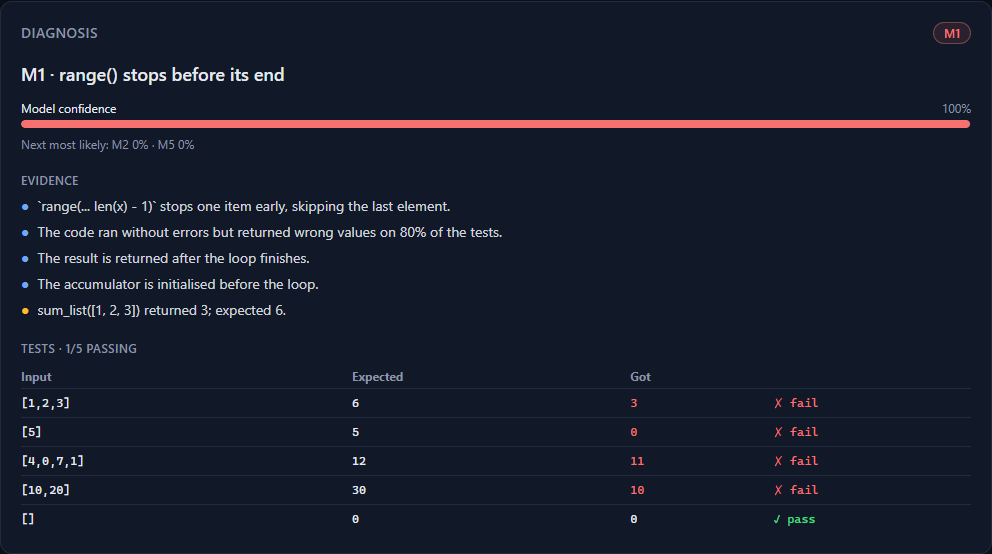 | 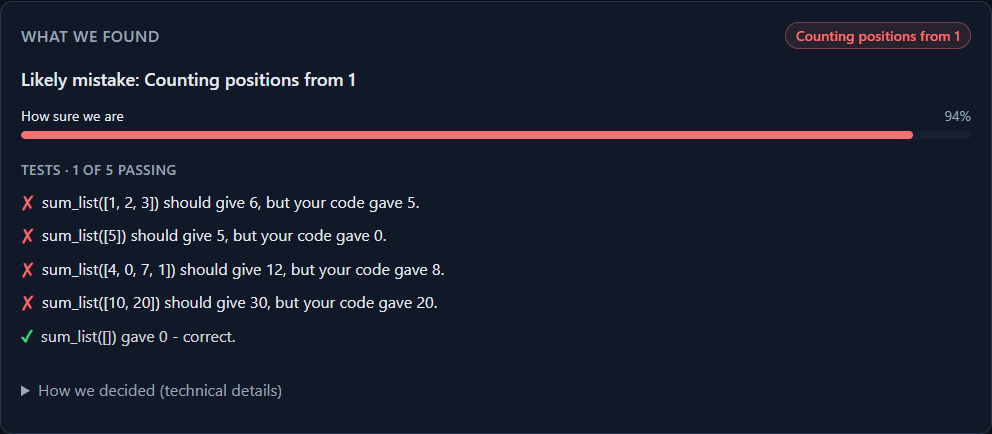 |

| M4 `total = 0` inside loop | M5 `return` inside loop |
|---|---|
| 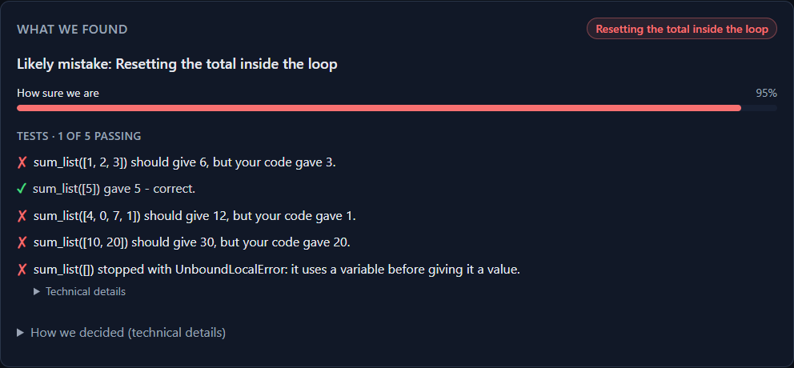 |  |

**Targeted intervention** - the learner's actual code with the cause highlighted, a verified minimal fix of it, the generic concept example below, then a concept check


**Prove it - "Not yet" with reasons, then "Resolved"**

| Not yet | Resolved |
|---|---|
| 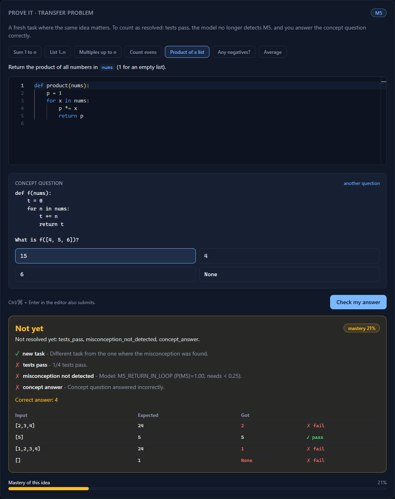 |  |

**Learner dashboard** and **Eval page**

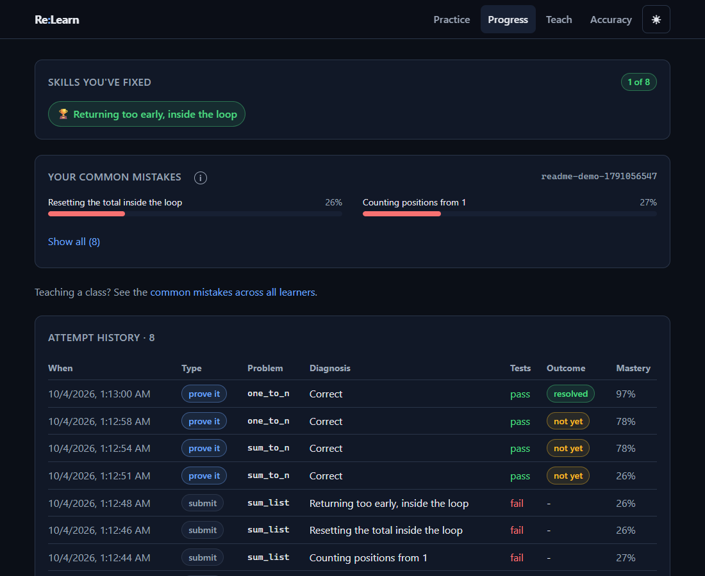

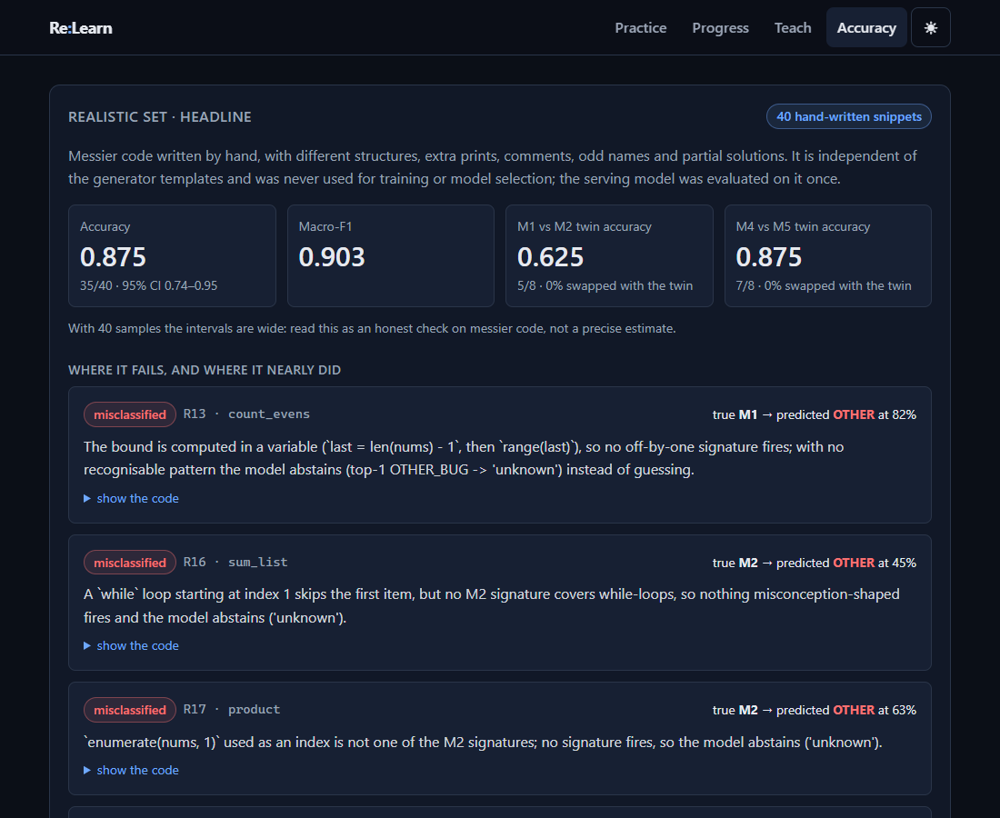

## Setup on Windows

**Prerequisites** (Windows 10/11): [Git](https://git-scm.com), **Python 3.12**, **Node.js 20+**. With winget:

```powershell
winget install Git.Git
winget install Python.Python.3.12
winget install OpenJS.NodeJS.LTS
```

Re-open PowerShell after installing. If `python` opens the Microsoft Store, that's the Windows stub - use the real install above.

### Quick start (one command)

```powershell
git clone https://github.com/itsjayrane/DaGOATS_maharashtra_round.git
cd DaGOATS_maharashtra_round
powershell -ExecutionPolicy Bypass -File .\run.ps1
```

`run.ps1` does everything on the first run - creates `ml\.venv`, installs the pinned Python dependencies, trains the model (~1 min), runs `npm install`, starts the **backend on http://localhost:8000** and the **frontend on http://localhost:5173**, waits until both are healthy, and opens the browser. **Ctrl+C stops both.** Logs go to `.run\`. Later runs start in a few seconds.

Options: `-NoBrowser`, `-ApiPort 8000`, `-WebPort 5173`, `-Retrain`.

### Manual setup (what the script does)

```powershell
# 1) Python environment + model
cd ml
py -3.12 -m venv .venv                      # or: python -m venv .venv
.\.venv\Scripts\python -m pip install -r ..\server\requirements-dev.txt
.\.venv\Scripts\python train.py             # writes ml\artifacts\diagnoser.joblib and docs\metrics.*

# 2) Backend (terminal 1)
cd ..\server
..\ml\.venv\Scripts\python -m uvicorn app.main:app --host 127.0.0.1 --port 8000

# 3) Frontend (terminal 2)
cd ..\client
npm install
npm run dev -- --host 127.0.0.1 --port 5173
```

Open http://localhost:5173. API docs: http://localhost:8000/docs.

### Tests, build, regenerate

```powershell
cd server; ..\ml\.venv\Scripts\python -m pytest -q        # 19 API tests
cd ..\ml;  .\.venv\Scripts\python -m pytest tests -q       # baseline tests (mock Gemini server)
cd ..\ml;  .\.venv\Scripts\python realistic_eval.py     # re-run the Realistic set evaluation
cd ..\client; npm run lint; npm run build                  # production build to client\dist
cd ..\ml;  .\.venv\Scripts\python -m relearn_ml.generate   # regenerate the dataset (labels re-verified)
```

### Configuration

| Variable | Where | Meaning |
|---|---|---|
| `VITE_API_URL` | client (`client\.env`) | backend base URL; defaults to `http://localhost:8000` |
| `CORS_ORIGINS` | server | extra allowed origins, comma-separated (localhost and `*.vercel.app` are always allowed) |
| `RELEARN_DB` | server | SQLite path (default `server\relearn.db`) |
| `GEMINI_API_KEY` | `ml/.env` (or the environment, `.env`, `server/.env`) | enables AI **hints** and AI-written **concept checks** through one shared client (`ml/relearn_ml/llm.py`, loaded with python-dotenv). Default model `gemini-flash-latest` (`GEMINI_MODEL` overrides), 15 s timeout (`RELEARN_LLM_TIMEOUT`, default 15), one attempt: on 429 / 503 / timeout / any API error the built-in hint or the verified built-in question is used and the reason is logged. `GET /hint-status` shows whether the key was found (never the key) |

### Troubleshooting

- **"running scripts is disabled"** - run with `-ExecutionPolicy Bypass` as shown above.
- **"Port 8000/5173 is already in use"** - close the other program or pass `-ApiPort` / `-WebPort`.
- **Editor shows "Loading editor..." forever** - Monaco is loaded from a CDN, so it needs internet access.
- **Backend says model not trained** - run `.\run.ps1 -Retrain` (or `python ml\train.py`).

## API

| Endpoint | Purpose |
|---|---|
| `GET /problems` | the 22 problems (prompt, starter code, one example; hidden tests stay server-side) |
| `POST /diagnose {problem_id, code, learner_id?}` | `{label, confidence, evidence[], test_results, probabilities, ambiguous, runner_up}` |
| `POST /intervene {label, problem_id?, code?}` | the targeted lesson; with `problem_id` + `code` it also returns `personalized`: the learner's code, highlighted lines, a minimal fix verified against the tests (or a verified reference solution), and the fix rule |
| `GET /transfer/{M}?learner_id=` | new problems + concept questions (answers withheld) |
| `POST /reassess {learner_id, misconception, problem_id, code, concept_answer}` | `{resolved, reasons[], message, mastery_after, ...}` |
| `GET /learner/{id}` | mastery 0..1 per misconception + attempt history |
| `POST /hint {problem_id, code, hint_level 1-3, learner_id?}` | progressive hint: `{level, hint, source}` (1 = where, 2 = what/why, 3 = small code nudge; max 60 words; guardrails enforced in code; built-in fallback; every request logged) |
| `GET /learner/{id}/hints` | hint usage log for a learner (totals, per problem, recent) |
| `GET /metrics`, `GET /metrics/confusion-matrix`, `GET /baseline` | evaluation data for the Eval page |

## Repo layout

```
client/    React + Vite + Tailwind + Monaco (Practice, Dashboard, Eval)
server/    FastAPI app (app/), SQLite store, sandbox wrapper, tests
ml/        relearn_ml/ (features, execution engine, templates, model), train.py, baseline.py, data/dataset.jsonl
content/   problems.json (22 problems + tests), misconceptions.json (lessons + concept questions)
docs/      metrics.md / metrics.json, confusion_matrix.png, screenshots/, deploy.md
render.yaml  backend deployment blueprint        run.ps1  one-command local start
```

## Deployment

Backend on **Render** (`render.yaml`; the model is trained during the build), frontend on **Vercel**. Step-by-step in [`docs/deploy.md`](docs/deploy.md).

## Limitations (read this)

- **Synthetic training data and no real learners.** Even the Realistic set was written by the same author who wrote the generator; it measures robustness to messier code, not generalisation to real students.
- **Confidence is not a guarantee.** The model can be wrong with very high confidence (one Realistic-set miss was 99%).
- **Single-misconception assumption.** Each submission gets one label; real code can contain several bugs at once.
- **Fixed problem bank** of 22 functions; new problems need tests and (for best accuracy) templates.
- **The model leans on execution.** Code that passes every test is classed `CORRECT`, so the "model no longer detects it" check mostly overlaps with "tests pass"; it adds value when a run fails with a recognisable misconception signature.
- **Ambiguous twin cases are flagged** (`ambiguous`, `runner_up`) but there is no follow-up probe question yet.
- **Mastery is a heuristic**, not a fitted knowledge-tracing model.
- **Sandbox is demo-grade**: subprocess + 2 s timeout + restricted builtins + AST banlist. No OS-level CPU/memory/filesystem limits - do not expose it to a hostile public.
- **AI hints are only as good as the LLM** and need `GEMINI_API_KEY`; the guardrails (word limit, no code at levels 1-2, at most 2 code lines at level 3, no leaked reference solution) are enforced in code, but a hint can still be unhelpful. Without a key the Hint button serves built-in hints.
- **Free-tier hosting**: Render's SQLite is on ephemeral disk (history resets on redeploy) and the service sleeps when idle.
- **Gemini baseline not yet run** (no API key in the build environment).
