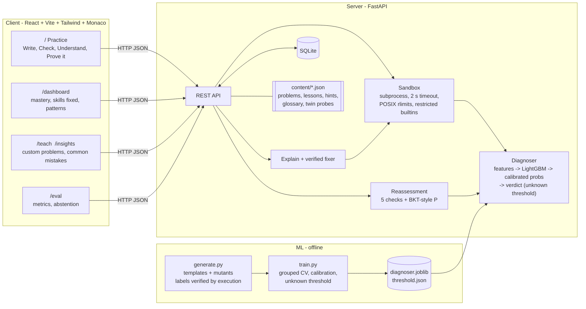
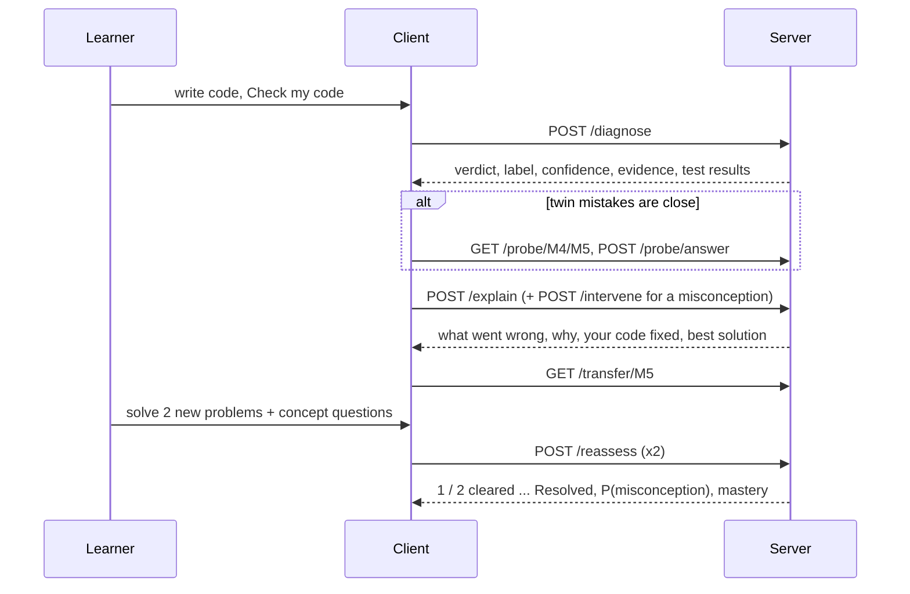

# Re:Learn

**A trained model finds the *misconception* behind a beginner's wrong Python code, the app teaches that one idea, then checks it actually stuck - a correct follow-up answer alone is not enough. When the model does not recognise the bug, it says so instead of guessing.**

Built for **Bit N Build 2026 - AI/ML track**. Domain: introductory Python programming. **Offline by default**: diagnosis, hints, explanations and lessons are curated or computed deterministically, with no API keys. One optional feature uses a free OpenAI-compatible LLM (Groq, Gemini, OpenRouter or a local Ollama) only to **write** practice problems from a learner's own question - see [Practise your own question](#practise-your-own-question-optional-ai-drafting).

| Diagnose | Explain | Prove it |
|---|---|---|
|  |  |  |

---

## Contents

1. [Problem](#problem) · 2. [Our approach](#our-approach) · 3. [Architecture](#architecture) · 4. [Misconception taxonomy and twin pairs](#misconception-taxonomy-and-twin-pairs) · 5. [Knowing when not to answer](#knowing-when-not-to-answer) · 6. [How reassessment works](#how-reassessment-works) · 7. [Model and metrics](#model-and-metrics) · 8. [For teachers](#for-teachers) · [Practise your own question](#practise-your-own-question-optional-ai-drafting) · [Show solution](#show-solution-every-problem) · 9. [Screenshots](#screenshots) · 10. [Setup on Windows](#setup-on-windows) · 11. [API](#api) · 12. [Repo layout](#repo-layout) · 13. [Deployment](#deployment) · 14. [Limitations](#limitations-read-this)

---

## Problem

Autograders say a solution is **wrong**. They don't say **why**. A beginner who writes `range(1, n)` and gets the wrong sum needs a different lesson from one who writes `return total` inside the loop - yet both just see "2 of 4 tests failed". Worse, fixing the symptom ("add `+ 1`") often leaves the underlying belief intact, and the same mistake comes back on the next problem.

Three things make this hard:

1. **Different causes, same wrong output ("twins").** Dropping the first list item vs. dropping the last one; keeping only the first item vs. only the last. Output alone can't tell them apart - the *structure* of the code can.
2. **"Correct" is not "learned".** A learner can pass the follow-up by luck, memory, or by fixing only the exact line they were told about.
3. **Not every bug is a known misconception.** A wrong formula is not "off by one"; teaching the wrong lesson is worse than teaching none.

## Our approach

Re:Learn is a closed loop with a **trained model in the middle**, an **honest "not sure"**, and a deliberately strict exit condition:

1. **Write → Check** - the learner's code runs in a sandbox against hidden tests. A LightGBM classifier reads *how the code is built* (AST signals) and *how it behaves* (execution signals) and returns a **verdict**: `correct`, `misconception` (one of 8, with a calibrated confidence and evidence) or `unknown` ("Not sure — closest guess: X (NN%)").
2. **Understand** - a 4-part explanation card: *what went wrong* (the failing check in plain words), *why* (one short template per misconception), *your code, fixed* (a minimal fix of the learner's **own** code, shown only if it passes every test) and *the best solution* (a verified reference). A confident misconception also gets a targeted mini-lesson and a concept check; an unknown bug **never** gets a canned lesson. When two look-alike twins are close, a one-question **Quick check** (a twin probe) decides which lesson to show.
3. **Prove it** - the learner solves **2 different** new problems where the same idea matters. A misconception is **resolved only** when both are cleared *and* a Bayesian-knowledge-tracing-style estimate of P(misconception) is below 0.15. Otherwise: "1 / 2 cleared" or "Not yet", with the exact reasons.
4. **Track** - mastery (= 1 − P) per misconception, "skills you've fixed", recurring patterns across problems, and for teachers a common-mistakes view across all learners.     

The UI is written for beginners: plain names instead of M-codes, a 3-step onboarding, a step indicator (Write → Check → Understand → Prove it), easy problems first with a real-life framing line, test results as sentences, Python errors in plain English, glossary tooltips, a light theme, 16 px text, 44 px touch targets and a layout that works at 360 px.
     
## Architecture



**One pass through the loop**



## Misconception taxonomy and twin pairs

| ID | Misconception | Typical wrong code | Core idea to teach |
|---|---|---|---|
| `CORRECT` | none | | |
| **M1** `RANGE_OFF_BY_ONE` | `range()` excludes its end | `range(1, n)` to include `n`; `range(len(x) - 1)` | stop is exclusive: `range(1, n + 1)` |
| **M2** `INDEX_FROM_ONE` | list indexes start at 1 | `x[1]` as first item; `x[len(x)]` as last; loop from index 1 | first is `x[0]`, last is `x[-1]` |
| **M3** `PRINT_NOT_RETURN` | `print` = `return` | `print(total)` with no `return` | a function with no `return` gives back `None` |
| **M4** `ACCUMULATOR_RESET` | accumulator initialised inside the loop | `for x in xs: total = 0; total += x` | initialise once, before the loop |
| **M5** `RETURN_IN_LOOP` | `return` just ends this iteration | `for ...: total += x; return total` | `return` leaves the whole function |
| **M6** `FLOAT_DIVISION` | `//` or `int()` where decimals are needed | `sum(x) // len(x)`; `c * (9 // 5) + 32` | `/` gives the exact quotient; `//` floors |
| **M7** `STRING_MUTABLE` | strings change in place | `s[0] = 'X'`; `s.upper()` with result discarded | strings are immutable, methods return new strings |
| **M8** `LIST_ALIASING` | `b = a` copies a list | `b = a; b.append(x)`; `[[0]*3]*3` | assignment shares the list; copy with `a[:]` |
| `OTHER_BUG` | a real bug that is none of the above | `return n * n` for "sum 1..n" | (no lesson - the app explains the failing check instead) |

### Twin pairs - same wrong output, different cause

| Twin pair | Why they look alike | What separates them |
|---|---|---|
| **M1 vs M2** | `sum_list` with `range(len(nums) - 1)` (M1, drops the **last** item) and `range(1, len(nums))` (M2, drops the **first**) both return `14` for `[5, 9, 5]` | stop bound shortened (`len(x) - 1`) vs. start index set to 1 / index `len(x)` used |
| **M4 vs M5** | the accumulator-reset version returns the **last** item, the return-in-loop version returns the **first**; both return `3` for `[3, 1, 3]` and for any one-item list | `total = 0` *inside* the loop body vs. a `return` *directly in* the loop body |

When the runner-up is the twin (flagged ambiguous, or at 20% or more), the app asks a **twin probe**: one predict-the-output question whose wrong answers each reveal one of the two beliefs ([`content/probes.json`](content/probes.json), 6 probes; every keyed answer is checked by running the snippet in [`content/verify_probes.py`](content/verify_probes.py)). Open **http://localhost:5173/?demo=1** for "Load demo bug" buttons for all four twins.

### How the personalised fix is made

For each misconception the server proposes small, source-preserving edits to the learner's code (character-offset edits guided by the AST, so formatting, comments and names survive), runs each candidate in the sandbox against the problem's tests, and shows the first one that passes everything (capped at 40 candidates, 24 executions and 3 s; results are cached). Examples: `range(len(x) - 1)` -> `range(len(x))`; `items[len(items)]` -> `items[len(items) - 1]`; `print(total)` -> `return total`; `total = 0` moved above the loop; `return` moved after the loop; `//` -> `/`; `s.upper()` -> `s = s.upper()`; `new = old` -> `new = old[:]`. **A fix is only ever shown if it passes every test**; otherwise the card says so and shows the verified best solution. `server/tests/test_personalize.py` runs the fixer over every wrong sample in the Realistic set and the training templates and asserts at least 93% coverage with a median of at most 2 changed lines.

## Knowing when not to answer

A diagnosis tool that always names one of 8 misconceptions will confidently teach the wrong lesson for any other bug. Re:Learn has an explicit way out:

- **`OTHER_BUG` training class** - built by **mutating correct solutions** (swap an operator, change a constant, invert a comparison, drop a statement, return the wrong variable) and keeping only mutants that parse, fail at least one test and fire **none** of the M1-M8 signature features; balanced to a typical class size and split by problem like everything else.
- **Unknown threshold** - `UNKNOWN_T` is tuned on grouped-CV **out-of-fold** calibrated probabilities as the highest threshold that still answers ≥ 90% of known-class samples ([`ml/artifacts/threshold.json`](ml/artifacts/threshold.json)): `UNKNOWN_T` = **0.152**, known-class coverage **0.900**, out-of-fold `OTHER_BUG` flagged **0.892**.
- **Verdict** - `unknown` when the top class is `OTHER_BUG` or the top probability is below `UNKNOWN_T` (custom teacher problems use a stricter 0.6). `label` stays the top-1 class for transparency. An unknown verdict **never changes mastery** and **never serves a canned lesson**: `/intervene` returns the step-by-step `/explain` payload instead.

**Never-seen misconceptions** ([`ml/eval_unseen.py`](ml/eval_unseen.py) → [`docs/unseen_eval.json`](docs/unseen_eval.json)): for each of M1..M8 the model is retrained **without that misconception at all** (3-fold, grouped by problem) and scored on it.

| held-out misconception | flagged "not sure" (good) | confidently wrong (dangerous) |
|---|---|---|
| M1 range off by one | 0.69 | 0.31 |
| M2 index from one | 0.67 | 0.33 |
| M3 print not return | 0.60 | 0.40 |
| M4 accumulator reset | 0.57 | 0.43 |
| M5 return in loop | 0.88 | 0.12 |
| M6 float division | 0.88 | 0.12 |
| M7 string mutable | 0.56 | 0.44 |
| M8 list aliasing | 0.57 | 0.43 |
| **mean** | **0.677** | **0.323** |

Known-class samples wrongly flagged "not sure" in the same runs: **0.069**. Read the right-hand column as the price of an 8-class taxonomy: about **one in three** genuinely new kinds of mistake would still get a confident (wrong) label.

## How reassessment works

`POST /reassess` checks one transfer attempt. A transfer problem is **cleared** when the first four checks pass; the misconception is **resolved** only when the fifth also passes. Every check returns pass/fail and a reason.

| Check | Passes when |
|---|---|
| `new_task` | the problem is different from the one where the misconception was found |
| `tests_pass` | all hidden tests pass in the sandbox |
| `misconception_not_detected` | the model gives the target misconception < 25% probability on the new code |
| `concept_answer` | the concept question is answered correctly (answers never leave the server) |
| `enough_evidence` | **≥ 2 different** transfer problems cleared since the last diagnosis **and** P(misconception) < 0.15 |

P(misconception) is a BKT-style estimate ([`server/app/bkt.py`](server/app/bkt.py), named constants: guess 0.10, slip 0.10, learn 0.10, resolve below 0.15, 2 problems); mastery = 1 − P. A clean transfer lowers P, a failed one raises it, the **same problem never counts twice**, clean code with a wrong concept answer is neutral, and a new diagnosis starts the evidence over. Unit tests check that two clean passes bring P below 0.15 from the prior, after a diagnosis and from the worst case, and that one pass is never enough.

## Model and metrics

**Model**: LightGBM multiclass over 10 labels (`CORRECT`, M1-M8, `OTHER_BUG`), temperature-calibrated (T = 3.25), features selected by grouped cross-validation.
**Features** (no raw text at inference):
- *AST structure* - `return` directly in a loop, variable re-initialised in a loop, `range` bound patterns, index patterns (`x[len(x)]`, `x[1]`), `//` vs `/`, item assignment on a parameter, discarded string-method results, list aliasing, `[row] * n`, ... plus one aggregate **signature count per misconception** (`sig_M1`..`sig_M8`, `sig_any`) - these let the model tell "no known pattern" (→ `OTHER_BUG`) from a weak known pattern.
- *Execution behaviour* - fraction of tests passing, `TypeError`/`IndexError`, returned `None`, printed output, input modified, rows sharing memory, type mismatches.
- *Task flags* - parameter and return types.

**Training data**: **synthetic** - 3,150 samples (2,441 train + 709 held out) generated from 22 problems' hand-written templates and the mutation operators above. **Every label is verified by running the code**. Generation is deterministic (`python -m relearn_ml.generate` reproduces the committed `ml/data/dataset.jsonl` byte for byte).

### Headline: the Realistic set (40 hand-written snippets)

To avoid grading the model on its own generator, we wrote **40 messier snippets by hand** ([`ml/data/realistic_test.csv`](ml/data/realistic_test.csv)): indirect loop bounds, `try/except`, recursion, `enumerate`, helper functions, comprehensions, debug prints, odd names, partial solutions. Labels were **checked by execution**. It is never used for training, model selection or threshold tuning. Source: [`docs/realistic.json`](docs/realistic.json).

| metric (Realistic set, n = 40) | value |
|---|---|
| accuracy | **0.875** (35/40; 95% CI 0.74-0.95) |
| macro-F1 | **0.903** |
| answered (not "not sure") | 36 of 40; **accuracy when answering 0.972** (35/36) |
| M1 vs M2 twin pair | 5/8 (the 3 misses are abstentions, none swapped with the twin) |
| M4 vs M5 twin pair | 7/8 (the miss was read as M1, not as the twin) |
| M7 / M8 recall | 1.00 (3/3) / 1.00 (4/4) |

All five misses: four are **abstentions** (R13 bound computed in a variable, R16 `while` loop from index 1, R17 `enumerate(start=1)` as an index, R21 `print` then explicit `return None` - no signature fires, so the model says "not sure" and the learner gets the step-by-step explanation), and **one confident misdiagnosis** (R28, `return` inside a hand-written `while` loop, read as M1 at 45% vs M5 at 33%). Before the abstention class (an earlier commit of `docs/realistic.json`) this set scored 0.950 with two *confident* errors; it now trades three of those right answers for honest "not sure"s and has one confident error. Full table with code on the Eval page and in [`docs/metrics.md`](docs/metrics.md).

**Unknown-bug set**: 10 more hand-written wrong-formula snippets ([`ml/data/realistic_other.csv`](ml/data/realistic_other.csv), never used for training or tuning): **9/10 flagged "not sure"**; 1 confidently mislabelled (O10, `multiples` producing n multiples, read as M1 at 81%).

### Template held-out set - an optimistic upper bound

Split **by problem**: 4 whole problems (`sum_list`, `average`, `shout`, `double_all`; 709 samples) never seen in training, model selection or threshold tuning ([`docs/metrics.json`](docs/metrics.json)).

| metric (unseen problems) | value |
|---|---|
| accuracy | 0.966 |
| macro-F1 | 0.958 |
| M1 vs M2 exact accuracy (84 / 70 samples) | 0.844 (0 swapped with the twin) |
| M4 vs M5 exact accuracy (56 / 56 samples) | 1.000 (0 swapped) |
| M7 / M8 recall | 1.000 / 1.000 |
| known-class samples answered | 0.964, **accuracy when answering 1.000** |
| held-out `OTHER_BUG` flagged "not sure" | 1.000 (37 samples) |


> **Treat these as an upper bound.** Held-out samples are renamed variants of a few dozen templates, and each held-out problem has close structural siblings in training. The more honest estimate is **grouped cross-validation over the 18 training problems** (10 classes): macro-F1 **0.766** for the production feature set (AST + execution + task flags) vs **0.654** with TF-IDF text features added - text memorises problem-specific wording, so the production model uses none.

### Model evaluation: baselines, ablation, calibration, explainability

Produced by [`ml/eval_models.py`](ml/eval_models.py) (separate from the build) and shown on the Eval page together with a model card and the Realistic confusion matrix. Every model is trained on the **same 18 training problems** and scored on the 4 held-out problems and the Realistic set (top-1, no abstention). 95% CIs are bootstrap, 1000 resamples ([`docs/model_comparison.json`](docs/model_comparison.json)).

| model | Realistic accuracy | Realistic macro-F1 | twins M1/M2 | twins M4/M5 | held-out accuracy | held-out macro-F1 |
|---|---|---|---|---|---|---|
| Majority baseline | 0.225 (0.10-0.35) | 0.041 (0.02-0.06) | 0.000 | 0.000 | 0.276 | 0.043 |
| Logistic regression | 0.875 (0.78-0.97) | 0.891 (0.72-0.97) | 0.750 | 1.000 | 0.979 | 0.971 |
| LightGBM (production) | 0.875 (0.75-0.97) | 0.903 (0.72-0.98) | 0.625 | 0.875 | 0.966 | 0.958 |

**Honest reading:** the features do most of the work. A plain logistic regression on the same features **ties LightGBM on Realistic accuracy and beats it on the held-out problems and on both twin pairs**; LightGBM is ahead only on Realistic macro-F1, and the CIs overlap almost completely. We keep LightGBM because its per-feature contributions drive the explanations and the abstention threshold was tuned for it, **not** because it is more accurate (logistic regression was never part of the grouped-CV model selection). With 40 snippets the Realistic set cannot separate the two.

**Ablation** - LightGBM retrained with feature groups removed (macro-F1; [`docs/ablation.json`](docs/ablation.json)):

| features | Realistic | held-out |
|---|---|---|
| all (AST + execution + task flags) | 0.903 | 0.958 |
| AST only | 0.808 | 0.781 |
| execution only | 0.691 | 0.628 |
| task flags only | 0.446 | 0.102 |
| without AST | 0.829 | 0.631 |
| without execution | 0.869 | 0.832 |
| without task flags | 0.871 | 0.964 |

AST structure is the strongest single group and execution adds to it. "Task flags only" (6 numbers describing the problem's parameter and return types) scoring 0.446 on Realistic shows that **knowing which problem it is already narrows the likely mistake** - a reminder that problem identity leaks into the label.

**Calibration** ([`docs/calibration.json`](docs/calibration.json), 10-bin reliability diagrams on the Eval page): temperature scaling (T = 3.25) lowers expected calibration error on the out-of-fold data it was fitted on (0.111 → 0.088) but **raises** it on the held-out problems (0.030 → 0.076), where the model becomes under-confident. Confidence percentages are therefore rough.

**Realistic bootstrap CIs** (serving model, [`docs/realistic.json`](docs/realistic.json)): accuracy 0.875 (0.75-0.97), macro-F1 0.903 (0.72-0.98).

**Explainability**: every diagnosis returns `why_features` - the top 3 LightGBM feature contributions (`pred_contrib`, i.e. TreeSHAP; no extra dependencies) with a plain-English sentence each ("your function prints but never returns"). The explanation card shows them under "Why the model thinks so".

**No real learner data was used.** Real students write messier code and combine misconceptions.

## For teachers

- **Custom problems** (`/teach`, `POST /custom/problems`): a statement, a function name, a reference solution and ≥ 4 tests. The reference runs in the sandbox; missing expected values are filled in from it; the request is rejected (422) if it does not parse or run, disagrees with a given expected value, mutates its input, or has too few tests. Custom problems appear with the badge "custom — teacher-written"; diagnosis there reports `in_distribution: false` and uses the stricter 0.6 threshold.
- **Common mistakes** (`/insights`, `GET /insights/common-mistakes`, `GET /problems/{id}/common-mistakes`): failed submissions grouped by misconception - count, share, unique learners (salted SHA-256, env `INSIGHTS_SALT`), the 2 shortest examples with the lines a verified fix changes, the typical failing test in words and the lesson summary. Unknown verdicts are clustered by failing-test signature. CSV export with hashed ids (code optional). A SYNTHETIC toggle shows demo data (`RELEARN_SEED_DEMO=1`), always labelled.
- **Learner patterns** (`GET /learner/{id}/patterns`): a misconception seen ≥ 2 times on ≥ 2 different problems, top 3, plus a suggested next problem (shown on the Dashboard and as "Recommended next").

## Practise your own question (optional AI drafting)

A learner types any beginner Python question ("return the second largest distinct number in a list, or None") and gets a problem to solve, checked exactly like the built-in ones. The AI only **writes the problem**; it never grades:

1. A **free OpenAI-compatible LLM** (Groq, Gemini, OpenRouter or a local Ollama) drafts `{function_name, reference_solution, test inputs, assumptions}` ([`server/app/draft.py`](server/app/draft.py), stdlib `urllib`, no SDK). The question is sent wrapped in `<question>` tags and the system prompt says it is data, not instructions.
2. **Expected outputs never come from the model**: any it sends are dropped, and the reference is **run in the sandbox** (`custom.build`, the same path as teacher problems). A draft that does not parse, does not run, mutates its input or has too few tests is sent back with the grader's error ("The grader rejected this draft: …") - at most 3 attempts inside a **25 s total budget** (each call's timeout is the time left), then a friendly "try rewording" message.
3. **Checking the learner's code is unchanged and offline**: hidden tests, LightGBM diagnosis (`in_distribution: false`, stricter abstention), explanation card and curated hints. No LLM is involved.
4. **The solution stays hidden** until the learner asks ("Show solution" first offers a hint) or passes every test ("Compare with our solution"). Explanations never show it as "best solution", and every reveal is logged (`solution_revealed`).
5. Keys and raw provider errors are never logged or returned; failures become friendly 502 / 503 messages (429 → "free AI limit reached").

Teachers get the same drafting on `/teach` ("Just type your question"): the draft fills the normal form for review and is saved with `source: ai_draft` and the badge "your question — AI-drafted, checked by running".

**Off by default.** With `LLM_*` unset nothing changes: no new UI, `/health` and every other response are identical.

## Problem-specific hints

"Get a hint" gives three levels for every problem: **1 what** (the goal with a real example from the tests, e.g. "For [2, 9, 7, 9], the answer is 7."), **2 how** (the concrete approach, e.g. "set() to drop repeated values and sorting") and **3 a nudge** (one first line, e.g. "Start with: distinct = sorted(set(nums))") - never the full solution. Built-in problems use the curated `content/hints.json`; custom and own-question problems get hints stored with the problem: written by the optional LLM from the verified solution and one sandbox-computed example when `LLM_*` is set, kept only if they pass guardrails (each <= 35 words, no code in hints 1-2, at most one code line in hint 3, no solution lines, all different, not generic, a real example in hint 1; one regeneration), otherwise generated from the verified solution's syntax tree ([`server/app/hintgen.py`](server/app/hintgen.py)). Hints react to the learner's current code: unless it is still the starter, the server re-runs the tests and puts the first failing test in front, in bold ("Right now sum_list([1, 2, 3]) gives 0 but should give 6."), and a confidently diagnosed misconception switches to that misconception's hint. `POST /hint` returns `{level, hint, prefix, source, kind}`.

## Show solution (every problem)

Every problem - built-in or "Practise your own question" - has a **Show solution** button next to "Get a hint". The first click asks "Try a hint first?" ([Get a hint] [Show it anyway]); after all tests pass the solution appears automatically under "Compare with our solution". Revealing is logged (`solution_revealed`) and never changes mastery.

- **The code is always the verified reference** - the built-in reference, or the sandbox-checked reference of a custom / AI-drafted problem - and the panel says "Solution checked by running the tests" with the pass count. No LLM ever writes solution code here.
- **The explanation** has four parts: *In short*, *Step by step* (3-6 steps), *Key idea* and *Watch out for* (the misconception most linked to the problem, from the lesson content). If the learner's last attempt was wrong and the fixer found a verified minimal fix, *Your code, fixed* shows it with the changed lines highlighted.
- **Explanations may be AI-written; solutions are always verified.** With `LLM_*` set, the same provider writes the explanation (one JSON reply, 15 s timeout, problem and code passed as data in `<problem>` / `<code>` tags). The reply is rejected - and a built-in explanation used instead - if it is not valid JSON, is too long (> 3 sentences per field or > 120 words), contains a code block or a function, or quotes any code that is not in the verified solution. Each explanation is cached per problem + solution, so the LLM is asked at most once. Without `LLM_*` the built-in explanation is generated from the solution's syntax tree ("Start `total` at `0`", "Loop over each `x` in `nums`", ...) and the lesson content; the button always works.

## Screenshots

**Twin pairs - same symptom, different cause, correctly separated**

| M1 `range(len(nums) - 1)` | M2 `range(1, len(nums))` |
|---|---|
|  |  |

| M4 `total = 0` inside loop | M5 `return` inside loop |
|---|---|
|  |  |

**Explanation card** - what went wrong, why, the learner's own code fixed (verified), the best solution


**Prove it - "1 / 2 cleared", then "Fixed for good!"**

| 1 / 2 cleared | Resolved |
|---|---|
|  |  |

**Progress dashboard** and **Eval page**


## Setup on Windows

**Prerequisites** (Windows 10/11): [Git](https://git-scm.com), **Python 3.12**, **Node.js 20+**. With winget:

```powershell
winget install Git.Git
winget install Python.Python.3.12
winget install OpenJS.NodeJS.LTS
```

Re-open PowerShell after installing. If `python` opens the Microsoft Store, that's the Windows stub - use the real install above.

### Quick start (one command)

```powershell
git clone https://github.com/itsjayrane/DaGOATS_maharashtra_round.git
cd DaGOATS_maharashtra_round
powershell -ExecutionPolicy Bypass -File .\run.ps1
```

`run.ps1` does everything on the first run - creates `ml\.venv`, installs the pinned Python dependencies, trains the model (~1-2 min), runs `npm install`, starts the **backend on http://localhost:8000** and the **frontend on http://localhost:5173**, waits until both are healthy, and opens the browser. **Ctrl+C stops both.** Logs go to `.run\`. Later runs start in a few seconds.

Options: `-NoBrowser`, `-ApiPort 8000`, `-WebPort 5173`, `-Retrain`.

### Manual setup (what the script does)

```powershell
# 1) Python environment + model
cd ml
py -3.12 -m venv .venv                      # or: python -m venv .venv
.\.venv\Scripts\python -m pip install -r ..\server\requirements-dev.txt
.\.venv\Scripts\python train.py             # writes ml\artifacts\ (model + threshold.json) and docs\metrics.*, docs\realistic.*

# 2) Backend (terminal 1)
cd ..\server
..\ml\.venv\Scripts\python -m uvicorn app.main:app --host 127.0.0.1 --port 8000

# 3) Frontend (terminal 2)
cd ..\client
npm install
npm run dev -- --host 127.0.0.1 --port 5173
```

Open http://localhost:5173. API docs: http://localhost:8000/docs.

### Tests, build, regenerate

```powershell
cd server; ..\ml\.venv\Scripts\python -m pytest -q        # API, abstention, custom problems, insights, resolution, probes, ...
cd ..\ml;  .\.venv\Scripts\python -m pytest tests -q       # curated content: hints, concept pool, glossary, twin probes
cd ..\client; npm run lint; npm run build                  # production build to client\dist
cd ..\ml;  .\.venv\Scripts\python -m relearn_ml.generate   # regenerate the dataset (deterministic, labels re-verified)
cd ..\ml;  .\.venv\Scripts\python train.py                 # retrain + threshold + Realistic evaluation
cd ..\ml;  .\.venv\Scripts\python eval_unseen.py           # leave-one-misconception-out (~1-2 min, separate from the build)
cd ..\ml;  .\.venv\Scripts\python eval_models.py           # baselines, ablation, calibration (seconds)
cd ..;     ml\.venv\Scripts\python content\verify_probes.py # run every twin-probe snippet
```

### Configuration

| Variable | Where | Meaning |
|---|---|---|
| `VITE_API_URL` | client (`client\.env`) | backend base URL; defaults to `http://localhost:8000` |
| `CORS_ORIGINS` | server | extra allowed origins, comma-separated (localhost and `*.vercel.app` are always allowed) |
| `RELEARN_DB` | server | SQLite path (default `server\relearn.db`) |
| `INSIGHTS_SALT` | server | salt for hashing learner ids in insights / CSV (a dev default is used if unset) |
| `RELEARN_SEED_DEMO` | server | `1` seeds a clearly labelled SYNTHETIC learner and class for demos |
| `RELEARN_RATE_LIMIT` | server | `off` disables per-IP / per-learner rate limits (on by default) |
| `LLM_BASE_URL`, `LLM_MODEL`, `LLM_API_KEY` | server (optional) | turn on "Practise your own question"; the key may be empty only for a localhost server. Put them in `server\.env` locally (gitignored) or in the Render dashboard |

One example per free provider (model names change - check the provider's list):

```ini
# Groq
LLM_BASE_URL=https://api.groq.com/openai/v1
LLM_MODEL=llama-3.3-70b-versatile
LLM_API_KEY=<your Groq key>

# Google Gemini (OpenAI-compatible endpoint)
LLM_BASE_URL=https://generativelanguage.googleapis.com/v1beta/openai
LLM_MODEL=gemini-2.5-flash
LLM_API_KEY=<your Gemini key>

# OpenRouter (free models end in :free)
LLM_BASE_URL=https://openrouter.ai/api/v1
LLM_MODEL=meta-llama/llama-3.3-70b-instruct:free
LLM_API_KEY=<your OpenRouter key>

# Ollama on this machine (no key)
LLM_BASE_URL=http://localhost:11434/v1
LLM_MODEL=qwen2.5-coder:7b
```

### Troubleshooting

- **"running scripts is disabled"** - run with `-ExecutionPolicy Bypass` as shown above.
- **"Port 8000/5173 is already in use"** - close the other program or pass `-ApiPort` / `-WebPort`.
- **Editor is a plain text box** - Monaco loads from a CDN; without internet the app falls back to a textarea after 5 s (everything else works).
- **"Waking the server…" banner** - the free Render backend sleeps when idle; buttons enable once `/health` answers.
- **Backend says model not trained** - run `.\run.ps1 -Retrain` (or `python ml\train.py`).

## API

All changes are additive; existing fields keep their meaning.

| Endpoint | Purpose |
|---|---|
| `GET /problems` | built-in + custom problems (prompt, starter, one example, `difficulty`, `framing`, `badge`; hidden tests stay server-side) |
| `POST /diagnose {problem_id, code, learner_id?}` | `{verdict, unknown, unknown_reason, closest_guess, label, confidence, why_features[], evidence[], test_results, probabilities, ambiguous, runner_up, in_distribution}` |
| `POST /explain {problem_id, code, label?}` | `{where_it_went_wrong, why, proposed_fix (only if it passes every test), best_solution}` |
| `POST /intervene {label, problem_id?, code?}` | the targeted lesson (+ `personalized` fix); for an unknown bug: `{unknown: true, explain}` and no lesson |
| `GET /probe/{a}/{b}`, `POST /probe/answer` | twin probe question (answers withheld) / which twin the answer reveals |
| `GET /transfer/{M}?learner_id=` | new problems + concept questions (answers withheld) |
| `POST /reassess {learner_id, misconception, problem_id, code, concept_answer}` | `{resolved, reasons[5], cleared_problems, needed, p_misconception, mastery_after, ...}` |
| `GET /learner/{id}`, `GET /learner/{id}/patterns`, `GET /learner/{id}/hints` | mastery + history / recurring mistakes + next problem / hint log |
| `POST /hint {problem_id, code, hint_level 1-3}` | curated progressive hint |
| `POST /custom/problems`, `GET /custom/problems` | teacher-written problems |
| `GET /insights/common-mistakes`, `GET /problems/{id}/common-mistakes`, `GET /insights/export.csv` | common-mistakes analytics |
| `GET /custom/draft/status` | `{available, model}` - is the optional drafting LLM configured (never the key) |
| `POST /custom/practice {statement, learner_id?}` | learner's own question -> saved, sandbox-checked problem: id, statement, starter, ONE example, assumptions, badge - **no reference solution** |
| `POST /custom/draft {statement}` | teacher review: the draft with sandbox-computed expected values (not saved) |
| `GET /problems/{id}/solution?learner_id=` | any problem: `{solution, explanation: {summary, steps[], key_idea, common_mistake}, source: ai\|builtin, verified, your_fix?}` (logged; mastery unchanged) |
| `GET /custom/problems/{id}/solution?learner_id=` | alias for custom problems (adds the older `reference_solution` / `note` fields) |
| `GET /glossary`, `GET /metrics`, `GET /metrics/confusion-matrix`, `GET /health` | tooltips, evaluation data, health |

Limits: code ≤ 20,000 characters; questions ≤ 2,000; per-minute rate limits (hint 10, diagnose 30, intervene 30, custom 5, draft 5, practice 5, solution 20) per IP and per learner.

In production the browser calls **`/api/...` on the Vercel origin**; `client/vercel.json` rewrites it to the Render backend, so ad blockers that block cross-site requests (`net::ERR_BLOCKED_BY_CLIENT`) do not break the app. Requests must finish well under Vercel's proxy time limit, which is why drafting has a 25 s total budget.

## Repo layout

```
client/    React + Vite + Tailwind + Monaco (Practice, Progress, Teach, Insights, Eval)
server/    FastAPI app (app/), SQLite store, sandbox wrapper, tests
ml/        relearn_ml/ (features, execution engine, templates, mutants, fixer, model), train.py, eval_unseen.py,
           realistic_eval.py, data/ (dataset.jsonl, realistic_test.csv, realistic_other.csv), artifacts/threshold.json
content/   problems, misconceptions (lessons + concept questions), hints, concept pool, glossary, problem_meta, probes
docs/      metrics.*, realistic.*, unseen_eval.json, confusion_matrix.png, screenshots/, deploy.md
render.yaml  backend deployment blueprint        run.ps1  one-command local start
```

## Deployment

Backend on **Render** (`render.yaml`; the build only installs the pinned dependencies - the trained model `ml/artifacts/diagnoser.joblib` and `threshold.json` are committed, and the server refuses to start with a clear message if a required file is missing), frontend on **Vercel**. Step-by-step in [`docs/deploy.md`](docs/deploy.md).

## Limitations (read this)

- **Synthetic training data and no real learners.** The Realistic and unknown-bug sets were written by the same author who wrote the generator; they measure robustness to messier code, not generalisation to real students.
- **Abstention is imperfect in both directions.** About one in three never-seen kinds of mistake still gets a confident wrong label (mean 0.323 in the leave-one-misconception-out test), and about 7% of known mistakes get a "not sure" (0.069). On the Realistic set the model abstains on 4 of 40 snippets it should have named.
- **Confidence is not a guarantee.** Calibration was fitted on synthetic out-of-fold data and makes the held-out problems *less* well calibrated; one Realistic-set miss and one unknown-bug miss are answered above the threshold.
- **The model choice is not decisive.** A logistic regression on the same features is about as accurate; the gains come from the features (and the abstention design), not from LightGBM itself.
- **Single-label assumption.** Each submission gets one label; real code can contain several bugs at once.
- **Twin probes are short.** 3 questions per twin pair; a learner can guess, and the probe only chooses which lesson to show (it never changes mastery).
- **Mastery is BKT-style with hand-set constants** (guess/slip/learn 0.10), not parameters fitted to learner data.
- **Custom problems are out of distribution.** The model never saw them, so diagnosis there is stricter and more often "not sure"; the explanation card still works because it only needs the tests and the reference.
- **Sandbox is demo-grade**: subprocess, 2 s timeout, restricted builtins, AST banlist and (Linux only) CPU/memory/file-size rlimits. Do not expose it to a hostile public.
- **AI-drafted problems are checked for consistency, not for intent.** The sandbox proves the drafted solution runs, never mutates its input and agrees with itself on every test - not that it does what the learner meant. "How we read your question" shows the model's assumptions; a wrong reading is still possible.
- **The diagnosis model was not trained on these problems**, so expect more "not sure" verdicts on learners' own questions (stricter threshold, `in_distribution: false`).
- **Free LLM tiers are rate-limited** (the app then says so) and some providers may use free-tier traffic for training - do not type personal data into the question box.
- **Free-tier hosting**: Render's SQLite is on ephemeral disk (history, custom problems and insights reset on redeploy) and the service sleeps when idle.
- **Screenshots** in `docs/screenshots/` are regenerated by hand and may lag the latest UI.

Creators---DA GOATS, 
hi,lol
GOAT 1 - JAY RANE, 
GOAT 2 - KAIRAV SHAH, 
GOAT 3 - ARNAV TAWDE,
GOAT 4 - HARSHIL DALAL.
