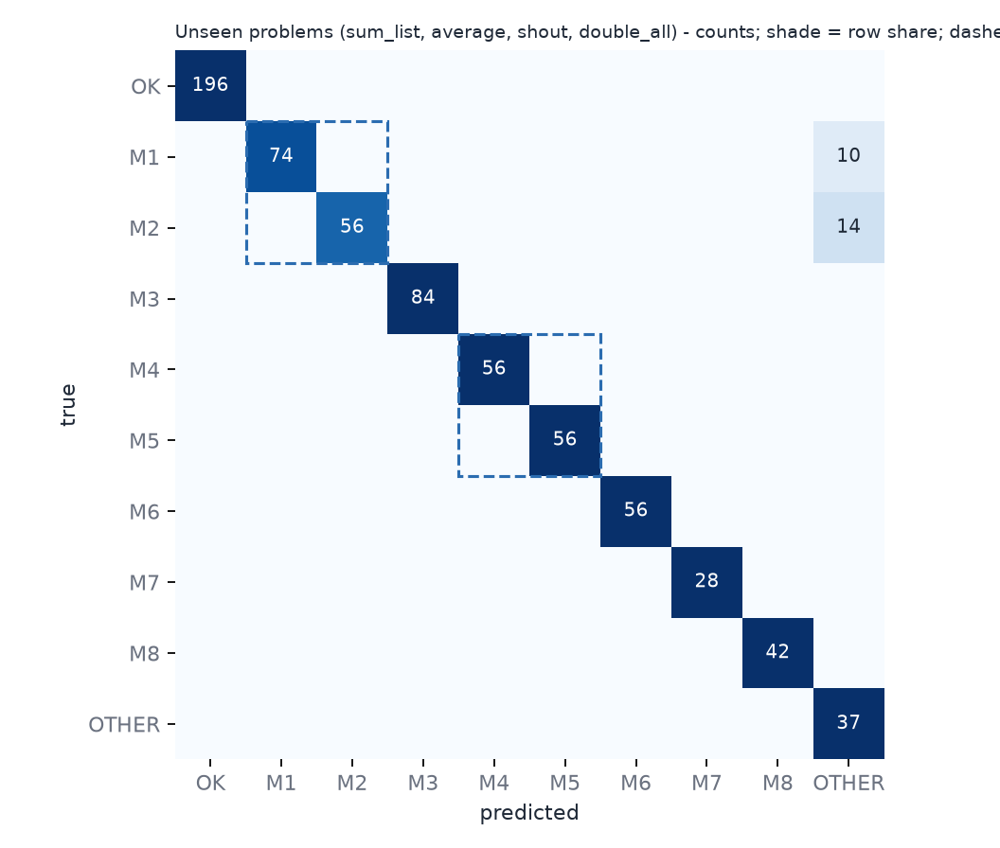

# Diagnoser metrics

Model: LightGBM multiclass (9 labels), temperature-calibrated. Generated by `ml/train.py`.

## Protocol

- Split **by problem_id**. Held-out (never seen in training or selection): `sum_list, average, shout, double_all` (672 samples).
- Training: 18 other problems (2292 samples).
- Feature set chosen by 5-fold grouped CV on the training problems only: **AST + execution + task flags** (CV macro-F1 0.919; TF-IDF + AST + execution + task flags: 0.758).
- Data are **synthetic** (templates in `ml/relearn_ml/templates.py`, labels verified by execution). No real learner data.

## Headline (unseen problems)

| metric | value |
|---|---|
| accuracy | 1.000 |
| macro-F1 | 1.000 |

Per held-out problem accuracy: `sum_list` 1.00, `average` 1.00, `shout` 1.00, `double_all` 1.00

## Twin pairs

Twins give the same wrong output on many inputs, so the model must use code structure. *Exact* = predicted the right label of the two; *swapped* = predicted the other twin.

| pair | n (true a / true b) | exact accuracy | predicted in pair | swapped with twin |
|---|---|---|---|---|
| M1 vs M2 | 154 (84 / 70) | 1.000 | 1.000 | 0.000 |
| M4 vs M5 | 112 (56 / 56) | 1.000 | 1.000 | 0.000 |

## Per-class report (unseen problems)

| class | precision | recall | F1 | support |
|---|---|---|---|---|
| CORRECT | 1.00 | 1.00 | 1.00 | 196 |
| M1_RANGE_OFF_BY_ONE | 1.00 | 1.00 | 1.00 | 84 |
| M2_INDEX_FROM_ONE | 1.00 | 1.00 | 1.00 | 70 |
| M3_PRINT_NOT_RETURN | 1.00 | 1.00 | 1.00 | 84 |
| M4_ACCUMULATOR_RESET | 1.00 | 1.00 | 1.00 | 56 |
| M5_RETURN_IN_LOOP | 1.00 | 1.00 | 1.00 | 56 |
| M6_FLOAT_DIVISION | 1.00 | 1.00 | 1.00 | 56 |
| M7_STRING_MUTABLE | 1.00 | 1.00 | 1.00 | 28 |
| M8_LIST_ALIASING | 1.00 | 1.00 | 1.00 | 42 |

Classes with support 0 had no sample among the held-out problems (macro-F1 above averages only classes present).

## Confusion matrix

## Caveats

- **Do not read a perfect score as 'solved'.** Samples are renamed/reformatted variants of a few dozen templates, so the effective held-out sample size is far smaller than the row counts above, and each held-out problem has close structural siblings in training (e.g. `count_evens`/`product` for `sum_list`). The 5-fold grouped CV over all 22 problems (`python -m relearn_ml.train`) is the more realistic estimate: macro-F1 about 0.94, with the weakest problems being the ones with unique structure.
- 4 held-out problems is a small, single split: treat the numbers as indicative, not tight estimates.
- Held-out problems are written in the same generator style as training ones; real learner code will be messier.
- Reproduce: `cd ml && .venv/Scripts/python -m relearn_ml.generate && .venv/Scripts/python train.py`.

<!-- baseline:start -->
## Our model vs Gemini baseline

**Baseline not run.** GEMINI_API_KEY not found (set it in ml/.env or the environment, then run `python baseline.py`).
<!-- baseline:end -->
